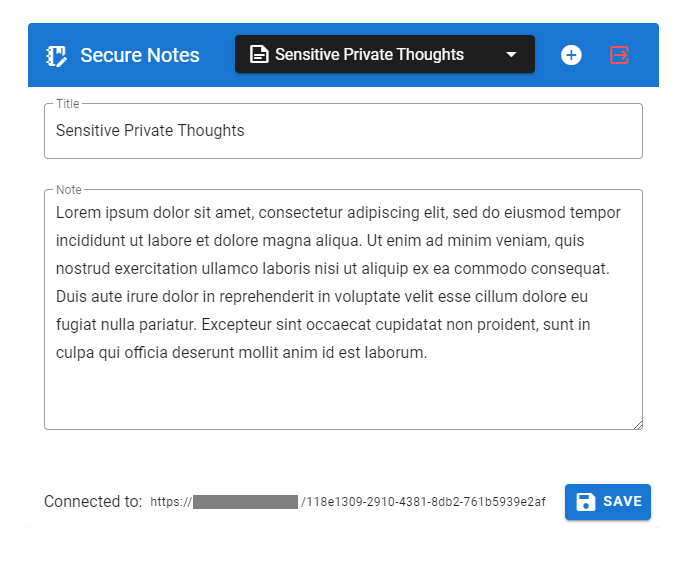
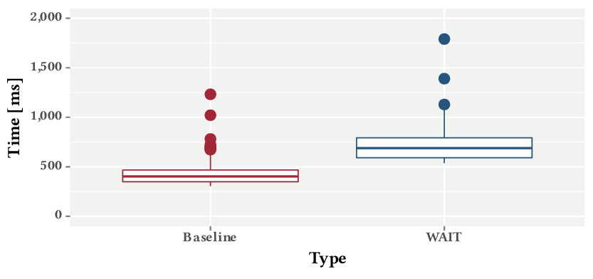

[](https://doi.org/10.1145/3412841.3442143) [](https://github.com/vs-uulm/wait-prototype/blob/master/LICENSE)

# WAIT: Protecting the Integrity of Web Applications with Binary-Equivalent Transparency

> Modern single page web applications require client-side executions of application logic, including critical functionality such as client-side cryptography.
> Existing mechanisms such as TLS and Subresource Integrity secure the communication and provide external resource integrity.
> However, the browser is unaware of modifications to the client-side application as provided by the server and the user remains vulnerable against malicious modifications carried out on the server side.
> Our solution makes such modifications transparent and empowers the browser to validate the integrity of a web application based on a publicly verifiable log.
> Our Web Application Integrity Transparency (WAIT) approach requires
> (1) an extension for browsers for local integrity validations,
> (2) a custom HTTP header for web servers that host the application, and
> (3) public log servers that serve the verifiable logs.
> With WAIT, the browser can disallow the execution of undisclosed application changes.
> Also, web application providers cannot dispute their authorship for published modifications anymore.
> Although our approach cannot prevent every conceivable attack on client-side web application integrity, it introduces a novel sense of transparency for users and an increased level of accountability for application providers particularly effective against targeted insider attacks.

This repository contains source code artifacts, experiments, and results associated with our SAC'21 publication.

For further details, please refer to:

Dominik Meißner, Frank Kargl, and Benjamin Erb. 2021. **WAIT: Protecting the Integrity of Web Applications with Binary-Equivalent Transparency**.
In The 36th ACM/SIGAPP Symposium on Applied Computing (SAC ’21), March 22–26, 2021, Virtual Event, Republic of Korea. ACM, New York, NY, USA, 4 pages. https://doi.org/10.1145/3412841.3442143

## Repository Structure
 * [`evaluation/`](evaluation) - evaluation artifacts to reproduce results and results featured in our SAC'21 publication (see [Evaluation](#evaluation)).
 * [`results/`](results) - our raw evaluation results as reported in our SAC'21 publication.
 * [`secure-notes/`](secure-notes) - a simple encrypted note taking app that we used as an example application to evaluate our prototype.
 * [`wait-cli/`](wait-cli) - shell script to sign app bundles and to interface with the example implementation of a WAIT log service.
 * [`wait-extension/`](wait-extension) - prototype browser extension that implements WAIT validation.
 * [`wait-log-service/`](wait-log-service) - example Node.js implementation of a WAIT log service that is used in the evaluation.

## Evaluation
To assess the practicability of our proof-of-concept prototype, we have evaluated the performance impact of WAIT as perceived by users of a WAIT-enabled application.
The evaluation in this repository follows the [Popper convention](https://getpopper.io/) for reproducible evaluations.
Our raw evaluation results are located in the [`results/`](results) directory (see [Reproducing Results](#reproducing-results) for an explanation of the files in this directory).

### Evaluation Goal
The evaluation measures the initial loading time of a single page application in a browser, both with and without WAIT.
We evaluated WAIT with a [simple note taking application](evaluation/example-app/) (see [Figure 1](#figure-1)), which locally takes a password to encrypt a dictionary of notes in the browser and stores it on a server, identified by a randomly generated UUID.
Users can then access their private notes by requesting the encrypted dictionary from the server, based on their dictionary's UUID.
As the password is never sent to the server, the demo application keeps the encrypted notes private.
The demo application is based on Vue.js and uses the browser-native WebCryptography API for authenticated encryption and decryption at the client side.

<a name="figure-1"></a>
<br />
Figure 1: Screenshot of the secure note-taking application used as example for the prototype implementation.

#### Setup
For the client in our testbed, we used a desktop computer with an Intel Core i7-7700 (quad-core with SMT; 3.60 GHz) CPU and 32 GB RAM, running Ubuntu 20.04 LTS with Firefox Nightly 83.0a1, and connected with an isolated gigabit ethernet connection.
The web server was placed on a host within the same local area network.

The evaluation consisted of 1,000 individual and isolated loads of the demo web application, without our extension (baseline) and with our extension enabled (WAIT).
The demo application contained 9 web resources (1 HTML page, 2 CSS stylesheets, 2 JavaScript files, 3 web fonts, and 1 favicon) with a total size of 1.5 MB.
For each run, we measured the page load times in the Firefox browser through timestamps by the `performance.timing` API and analyzed the complete time it took to load the application.
That is the time difference between the navigation start event up until all load event handlers had been processed.
Caching was disabled to prevent systematic errors of measurements.
All test runs were orchestrated by [puppeteer](https://pptr.dev/), which controlled the Firefox instance automatically.

#### Experiments & Outcomes
[Figure 2](#figure-2) illustrates the loading time for with and without WAIT.
Loading times increased consistently when WAIT was enabled (M<sub>base</sub> = 415 ms, SD<sub>base</sub> = 82.2 ms vs. M<sub>WAIT</sub> = 702 ms, SD<sub>WAIT</sub> = 120.0 ms).

#### Discussion of Results
On average, loading times of the demo application increased by 69% when WAIT was in use due to the local integrity check.
While this represents a pronounced increase in the loading times, we argue that this increase is still reasonable for the targeted web applications (i.e., single-page applications and progressive web applications).
In fact, the integrity check only slows down the initial load, but not the subsequent user interactions with the web application.

<a name="figure-2"></a>
<br />
Figure 2: Distribution of loading times of a web page without integrity protection (baseline) and with integrity transparency (WAIT).

### Reproducing Results
The Popper workflow in this repository can be used to replicate results, compute statistics, and generate a box plot from the evaluation results.
Assuming both [Docker](https://www.docker.com/) and the [Popper CLI tool](https://getpopper.io/) are installed, you can simply call `popper run` in the root directory of the repository to run the workflow.

Our Popper workflow (see [`.popper.yml`](.popper.yml)) consists of two steps:
 * `measure` - Uses puppeteer to log the time it takes to repeatedly load the secure-notes demo application with and without WAIT enabled.
 * `analyze` - Computes basic statistics on the time data collected in the previous step and generates a box plot.

Post execution the [`results/`](results) directory will contain the following files:
 * [`times-baseline.csv`](results/times-baseline.csv) - Measurements of the baseline, i.e., without the WAIT extension enabled.
 * [`times-extension.csv`](results/times-extension.csv) - Measurements with the WAIT extension enabled.
 * [`plot.pdf`](results/plot.pdf) - A box plot comparing the baseline evaluation to the WAIT extension.
 * [`statistics.csv`](results/statistics.csv) - Basic statistics of measured load times.

## Citation
If you find our work useful in your research, consider citing our paper:

```bibtex
@inproceedings{meissner2021wait,
    title = {WAIT: Protecting the Integrity of Web Applications with Binary-Equivalent Transparency},
    author = {Meißner, Dominik and Kargl, Frank and Erb, Benjamin},
    isbn = {978-1-4503-8104-8/21/03},
    publisher = {ACM},
    url = {https://doi.org/10.1145/3412841.3442143},
    doi = {10.1145/3412841.3442143},
    booktitle = {The 36th ACM/SIGAPP Symposium on Applied Computing},
    year = {2021},
    month = {03},
    location = {Virtual Event, Republic of Korea},
    series = {SAC '21}
}
```

## License
The WAIT prototype and related artifacts is licensed under the terms of the [MIT license](LICENSE).
